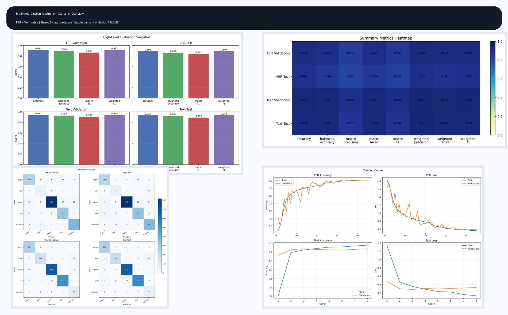
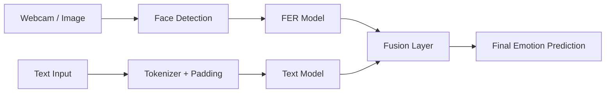
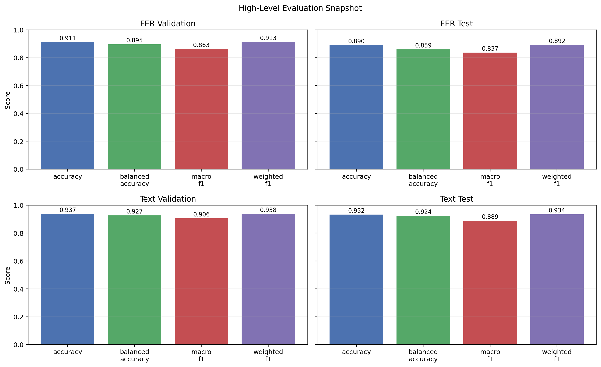
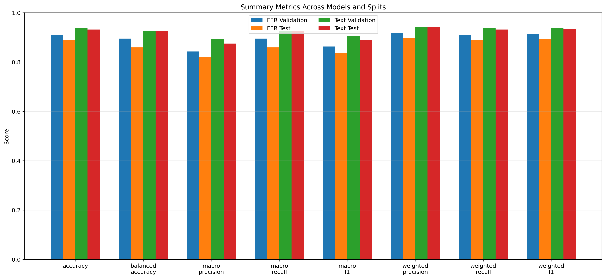
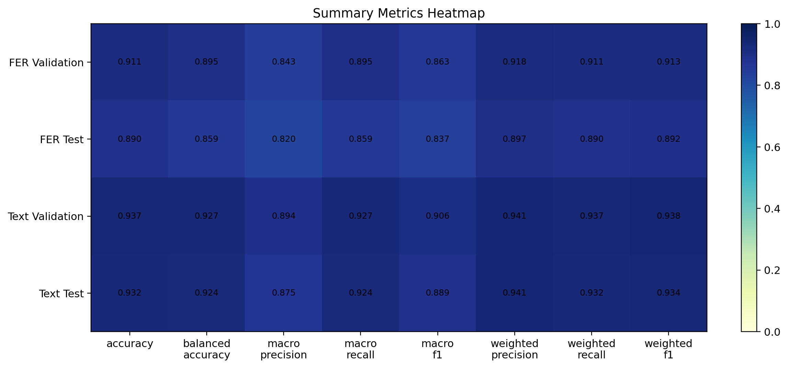
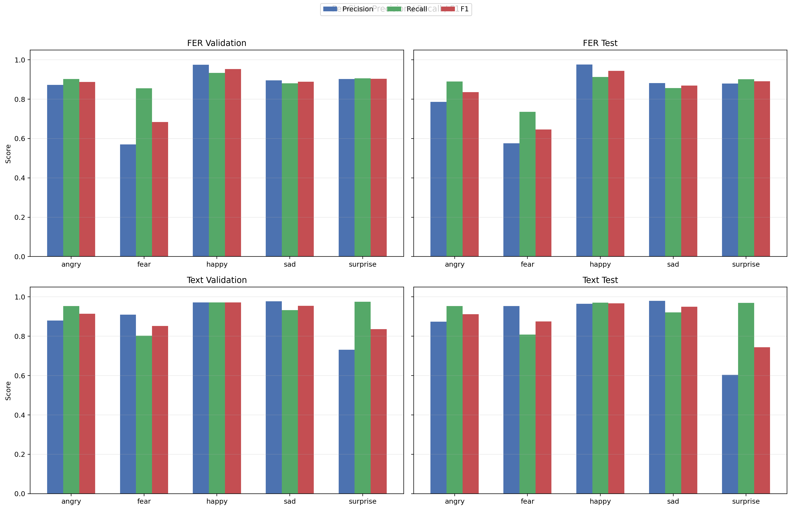
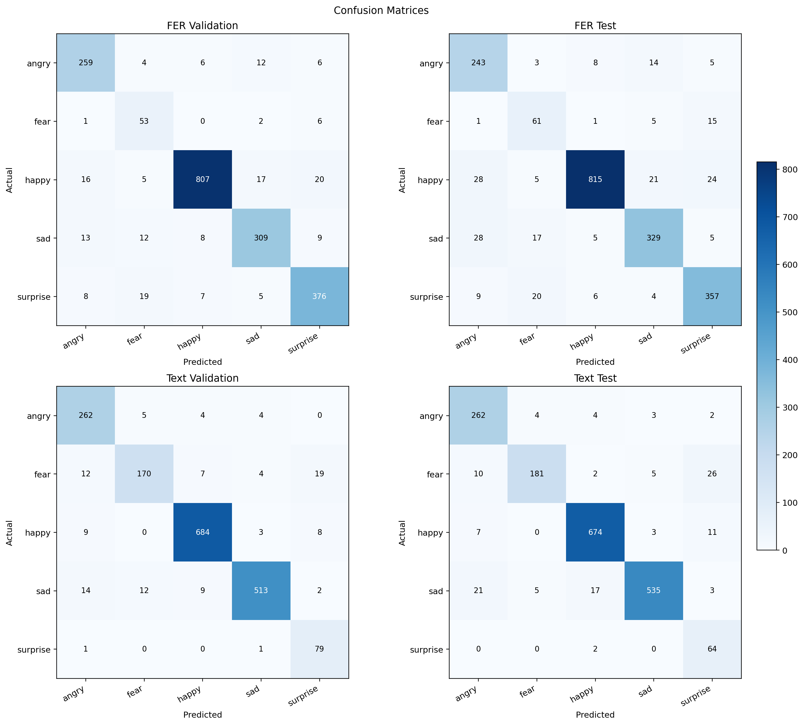
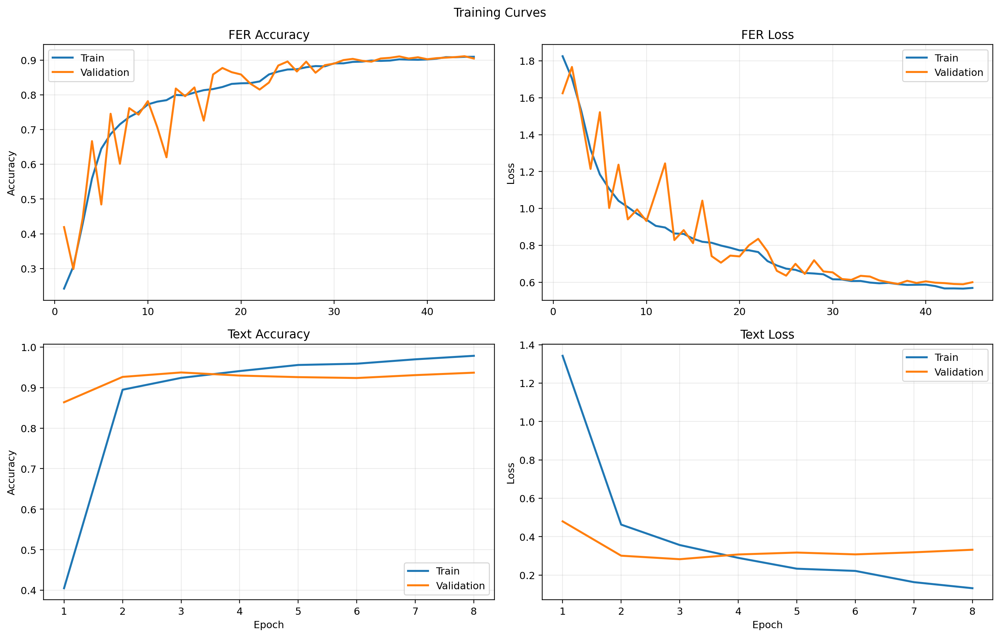

# EmoFusion: Multimodal Emotion Recognition

Multimodal emotion recognition pipeline combining facial expression analysis and text-based sentiment understanding into one shared 5-class emotion space.

**Authors:** Dylan Marshall, Chaitanya Shirpurkar, Darshan Agrawal



## Overview

This project combines two trained models:

- **Facial emotion recognition** using FER / FER+ image data
- **Text emotion recognition** using an NLP emotion dataset

Both models are aligned to one shared label space:

```text
["angry", "fear", "happy", "sad", "surprise"]
```

The system supports:

- realtime webcam-based facial emotion prediction
- text emotion prediction
- multimodal fusion of face + text
- Gradio demo
- Streamlit demo
- FastAPI backend
- evaluation graph generation for reports and GitHub documentation

## Label Alignment

To make both models compatible, labels were normalized into the same final classes.

### Final classes

```text
angry, fear, happy, sad, surprise
```

### Removed classes

```text
disgust, neutral, love
```

### Text label remapping

- `joy -> happy`
- `sadness -> sad`
- `anger -> angry`

## System Pipeline



## Evaluation Summary

| Model / Split | Accuracy | Balanced Accuracy | Macro F1 | Weighted F1 |
|---|---:|---:|---:|---:|
| FER Validation | 0.9111 | 0.8953 | 0.8632 | 0.9133 |
| FER Test | 0.8896 | 0.8592 | 0.8367 | 0.8922 |
| Text Validation | 0.9374 | 0.9268 | 0.9057 | 0.9379 |
| Text Test | 0.9321 | 0.9242 | 0.8893 | 0.9339 |

## Evaluation Graphs

### 1. High-Level Snapshot



### 2. Summary Metrics Comparison





### 3. Per-Class Performance



### 4. Confusion Matrices



### 5. Training Curves



## Key Findings

- text model performs better overall than facial model on both validation and test sets
- FER model is strongest on `happy` and `surprise`
- FER model is weakest on `fear`, which is common in facial emotion datasets
- text model shows stronger class balance and higher macro F1
- shared label alignment makes fusion possible without extra post-processing hacks

## Repository Structure

```text
emotion_recognition_pipeline/
├─ emotion_pipeline/
│  ├─ artifacts.py
│  ├─ facial.py
│  ├─ fusion.py
│  ├─ stability.py
│  └─ text.py
├─ docs/
│  ├─ assets/
│  ├─ GITHUB_PUBLISH.md
│  ├─ RESULTS.md
│  └─ SETUP.md
├─ evaluation_graphs/
├─ api_server.py
├─ demo_runtime.py
├─ generate_evaluation_graphs.py
├─ gradio_app.py
├─ multimodal_realtime.py
├─ predict.py
├─ realtime_camera.py
├─ streamlit_app.py
└─ requirements.txt
```

## Quick Start

### 1. Create virtual environment

```powershell
cd C:\Users\HP\Desktop\caveman\emotion_recognition_pipeline
python -m venv .venv
```

### 2. Install dependencies

```powershell
.\.venv\Scripts\python.exe -m pip install -r requirements.txt
```

### 3. Verify trained artifacts

Expected artifact folder:

```text
D:\emotion_model_artifacts
```

Run:

```powershell
.\.venv\Scripts\python.exe check_artifacts.py --artifacts D:\emotion_model_artifacts
```

## Run Demos

### Gradio

```powershell
.\run_gradio_demo.bat
```

### Streamlit

```powershell
.\run_streamlit_demo.bat
```

### FastAPI

```powershell
.\run_api_server.bat
```

### Realtime multimodal webcam

```powershell
.\.venv\Scripts\python.exe multimodal_realtime.py --artifacts D:\emotion_model_artifacts --mirror --interactive-text
```

### Single prediction

```powershell
.\.venv\Scripts\python.exe predict.py --artifacts D:\emotion_model_artifacts --text "I feel nervous"
```

## Generate Evaluation Graphs

All README graphs are generated from exported notebook metrics.

```powershell
.\.venv\Scripts\python.exe generate_evaluation_graphs.py --artifacts D:\emotion_model_artifacts
```

Output:

```text
C:\Users\HP\Desktop\caveman\emotion_recognition_pipeline\evaluation_graphs
```

## Trained Model Artifacts

Notebook exports deployment-ready files to:

```text
D:\emotion_model_artifacts
```

Expected files:

```text
best_fer_model.keras
fer_model.keras
best_text_model.keras
text_model.keras
text_tokenizer.pkl
label_maps.json
inference_config.json
```

For GitHub, recommended approach:

- keep code and graphs in repo
- keep large trained weights outside repo
- publish weights via GitHub Releases, Git LFS, or cloud storage

## Documentation

- [Results Documentation](docs/RESULTS.md)
- [Setup Guide](docs/SETUP.md)
- [GitHub Publish Guide](docs/GITHUB_PUBLISH.md)

## Future Improvements

- stronger face detector or face alignment
- uncertainty handling for low-confidence predictions
- temporal smoothing for webcam predictions
- speech-to-text input for richer multimodal fusion
- Docker packaging
- cloud deployment
